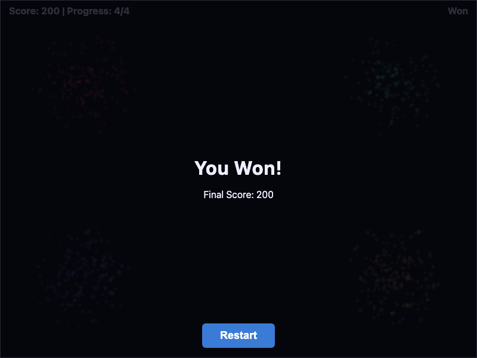
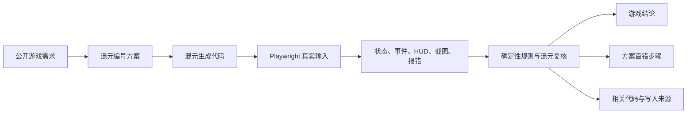

# GameTestLab

GameTestLab 用真实浏览器检查混元生成的网页游戏。它不仅判断游戏终局是否获胜，还会核对生成前的编号方案、代码实现和逐步试玩记录，找出第一次出现偏差的玩家操作、方案步骤与相关代码。

本项目参加 2026 腾讯犀牛鸟开源人才培养计划“可验证场景：过程评估与错误定位”课题。项目由个人完成，不是腾讯或混元团队的官方项目。

## 正式实验

| 项目 | 结果 |
| --- | ---: |
| 正式审计游戏 | 15 |
| 玩法路径 | 47 |
| 浏览器重复执行 | 141 |
| 当前接口声明合规 | 8/15 |
| 原固定路径到达预期终点 | 14/47 |
| 可独立核对的错误步骤同时检出并定位 | 1/3 |
| “游戏结果正确、方案过程错误”案例 | 1 |

原固定路径中存在输入时机、状态字段和界面文案方面的判据问题，因此 14/47 只记录原测试执行结果，不作为游戏正确率。1/3 的定位结果来自三个可独立核对的方案错误，样本较少，不外推为总体准确率。完整口径见[最终实验报告](reports/analysis-report.md)。



上图是一个过程错误实例。公开规则要求四次正确输入各加 25 分，正确终分应为 100。混元生成的方案第 3 步和代码都加入了额外 100 分，浏览器三次执行均以 200 分结束。评估器判定过程有误，并定位到方案第 3 步。

## 评估对象

本项目评估混元实际留下的外部过程，不推测模型内部思维。每题保存四类材料：公开需求、生成前编号方案、实际代码写入记录和真实浏览器运行证据。过程评价的基本单位是方案里可以验证的一条判断，例如“这次输入增加 25 分”“重开后计时归零”或“角色能够落到下一个平台”。



生成和复核均使用 CodeBuddy CN 中的 Hy3 High。生成阶段只提供公开需求和接口说明；预期结果在生成完成后才交给测试程序，避免把答案写入生成提示。

## 检查内容

同一次试玩从三个层面留下证据。

| 层级 | 检查内容 |
| --- | --- |
| L1 运行 | 页面能否启动，是否出现 console、page、网络或外部依赖错误 |
| L2 玩法 | 输入后的状态、计分、事件、胜负、重开和存档是否符合公开规则 |
| L3 界面 | HUD 是否与内部状态一致，DOM、Canvas 和截图是否支持当前结论 |

计时和物理游戏可冻结浏览器时钟，按固定时间片推进。平台游戏会读取位置、速度、碰撞和支撑关系，从而区分“没有及时刷新”“跳不到平台”和“穿过平台”。双人游戏可以同时打开两个页面；存档游戏会在刷新后继续检查浏览器存储。

框架继续执行安全的失败路径，不因中途出现一次错误就停止。这样可以发现中间状态错误、后续错误抵消以及最终结果碰巧正确的 `lucky pass`。

## 题集与实验范围

候选题库包含 96 道完整游戏任务，由动作、益智、创意、模拟和教育五类任务构成，不含摄像头、视频理解和语音输入。正式实验在生成前冻结前 15 题，不按结果挑选。

| 难度 | 题数 | 主要特征 |
| --- | ---: | --- |
| D1 | 4 | 短规则链、单页面、直接状态转换 |
| D2 | 6 | 多阶段玩法、计时或边界条件 |
| D3 | 5 | 多页面、持久化、复杂交互或物理过程 |

正式子集包含动作 6 题、益智 5 题、创意 2 题、模拟 2 题，没有教育类任务。题量和玩法构成不足以支持可靠的难度下降临界点，报告保留分层数字，但不强行给出趋势结论。

## 主要发现

模型生成错误与测试标准错误需要分开处理。赛车和流星游戏的原通关输入会主动撞上障碍，按公开规则重写输入后，胜负路径均连续三次符合预期。2048 的原测试因为观察对象多出一个字段而在操作前停止，但真实键盘与刷新路径可以完成获胜、失败和存档。测试失败因此不能直接等同于游戏错误。

过程评价能够发现终局检查遗漏的问题。2048 的核心玩法可以运行，原方案却把一条实际获胜路径写成失败；补充复核定位到方案第 3 步。联机五子棋的方案声称重开后计时归零，双页面实际操作连续三次否定这一判断，但原混元复核没有给出对应步号，形成一次漏定位。

更完整的结果、逐例证据和限制见以下文件：

| 阅读目的 | 文件 |
| --- | --- |
| 完整方法与实验结果 | [最终实验报告](reports/analysis-report.md) |
| 15 题简明结果 | [正式审计终稿](results/process-15-v1/FINAL.md) |
| 评估器有效性逐例核对 | [过程定位验证](results/process-15-v1/PROCESS-VALIDITY.md) |
| 过程评价定义与命令 | [过程评价方法](docs/process-evaluation.md) |
| 课题要求逐项对应 | [任务对照](docs/task-alignment.md) |
| 数据来源、用途和限制 | [数据卡](docs/dataset-card.md) |
| 十页中文汇报材料 | [汇报 PPT](docs/evaluation-slides-15-cn-v11.pptx) |

## 运行

环境要求为 Node.js 22+、pnpm 10+ 和 Chromium。

```bash
pnpm install
pnpm exec playwright install chromium
pnpm run check
pnpm run test:browser
```

`pnpm run check` 运行类型、数据、Vitest 和 jsdom 检查；`pnpm run test:browser` 运行真实 Chromium 回归测试。查看只读评审应用：

```bash
pnpm run app
# http://127.0.0.1:4175/
# http://127.0.0.1:4175/mined
# http://127.0.0.1:4175/exploration
```

重新试玩粒子乐队不需要调用混元，也不会覆盖原始记录：

```bash
pnpm exec tsx scripts/evaluate-generated-task.ts \
  --task particle-orchestra \
  --task-dir results/process-15-v1/particle-orchestra/task \
  --game-dir results/process-15-v1/particle-orchestra/game \
  --out artifacts/particle-replay-new \
  --generator codebuddy-hy3 \
  --replays 3
```

重新生成游戏属于新实验，结果不会自动等同于仓库中冻结的正式记录。

## 接入新的游戏

游戏需要提供入口页面、可执行控件、只读观察桥和 `game.manifest.json`。测试计划定义真实键鼠或触控操作、检查点及预期结果。若已有需求文档或 PRD，可以用它帮助混元提出测试建议，但 PRD 本身不作为标准答案。

一次评测会保存：

- `events.jsonl`：每次操作后的状态、事件、界面和截图引用；
- `cases.json`：每条路径的 L1/L2/L3 结果与首次偏差；
- `summary.json`：汇总、错误类型和难度拆分；
- `screenshots/`：逐步画面证据。

接口格式和接入步骤见[评估方法](docs/evaluation-method.md)。

## 仓库结构

```text
src/runtime/       Chromium 输入、时间推进与证据采集
src/evaluation/    分层判定、首错定位和指标
src/contracts/     游戏、测试计划和结果的数据结构
src/agents/        Hy3 方案生成与复核接口
datasets/          96 道候选任务、校准样本和私有 oracle
results/           正式 15 题及逐例可复验证据
reports/           完整实验报告与验证报告
tests/             Vitest、jsdom 和 Playwright 测试
docs/              方法、数据卡、任务对照和汇报材料
```

代码与仓库自建样本使用 [MIT License](LICENSE)。外部游戏和素材需单独记录来源与许可证。
