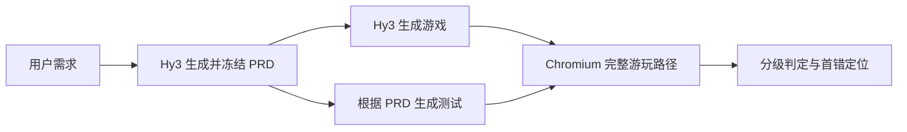

# PRD2Play

> 用户让 AI 生成浏览器游戏：AI 先写 PRD，再生成游戏；PRD2Play 根据冻结 PRD 进行真实 playthrough 测试和首错定位。

**项目声明：本仓库是个人参加 2026 腾讯犀牛鸟开源人才培养计划相关活动的作品，不是腾讯或混元团队的官方项目。项目只通过 API 调用 Hy3，不训练、不微调，也不发布模型权重。**

[项目方案](docs/proposal.md) · [赛题要求对照](docs/task-alignment.md) · [Pilot 结果](results/sample/README.md)

## 核心流程



PRD 是中间契约，不是唯一真值。系统还会检查 PRD 是否漏掉用户的明确要求，避免出现“游戏完全实现了一份残缺 PRD，却仍被判为成功”。

## 三级测试

| 层级 | 检查内容 | 主要工具 |
| --- | --- | --- |
| L1 运行 | 页面加载、启动、输入、资源和运行时错误 | Playwright + Chromium |
| L2 逻辑 | 状态转移、计分、事件、终局和完整路径 | PRD 检查点 + 状态/事件轨迹 |
| L3 界面 | HUD 与内部状态一致、画面功能正确 | DOM、Canvas、截图；可选多模态 |

系统分别输出终局是否正确、过程是否正确以及第一处偏离。如果终局正确但中间逻辑错误，会标记为 `lucky_pass_detected=true`。

Vitest 负责 schema、判分器和纯逻辑测试；jsdom 只负责快速 DOM 单测；真实可玩性必须通过无头 Chromium 验证。

## 快速开始

环境要求：Node.js 22+、pnpm 10+。

```bash
pnpm install
pnpm exec playwright install chromium
pnpm run check
pnpm run test:browser
pnpm run eval:sample
```

查看示例游戏：

```bash
pnpm run demo:serve
# http://127.0.0.1:4173/examples/coin-collector/index.html
```

## 使用 Hy3 生成游戏

```bash
cp .env.example .env
pnpm run hy3:probe

pnpm run hy3:generate -- \
  --brief examples/coin-collector/USER_BRIEF.md
```

一次生成包含两个独立步骤：

1. 用户 brief → 冻结的结构化 PRD；
2. 冻结 PRD → `index.html`、`styles.css`、`game.js` 和 `game.manifest.json`。

产物写入 `artifacts/generations/<run-id>/`，同时保存脱敏请求、原始响应和 SHA-256。API Key 不会写入产物。

也可以单独根据已有 PRD 生成分层测试建议：

```bash
pnpm run hy3:plan -- \
  --prd examples/coin-collector/PRD.md \
  --case datasets/cases/clean-control/case.json
```

## 数据与结果

每个测试案例包含：

- `case.json`：需求、控件、难度和游玩场景；
- `oracle.private.json`：检查点期望、首错和错误类型真值；
- `events.jsonl`：逐动作状态、事件和 UI 证据；
- `cases.json` / `summary.json`：逐例和汇总结果。

当前 5 个 Coin Collector 案例是人工构造的 evaluator 校准集，包括 clean、终局错误、中间错误补偿、HUD 错误和跨层遮蔽。实际 Chromium pilot 结果位于 [results/sample](results/sample/README.md)：20 项 Vitest 和 2 项 Playwright 测试通过。

这些数字只证明评测管线能识别预设故障，**不代表 Hy3 的真实游戏生成能力**。目前仍待完成真实 Hy3 批量生成、更多独立游戏、人审和两分钟 Demo。

## 仓库结构

```text
src/agents/          Hy3 两阶段游戏生成与 PRD 测试规划
src/contracts/       PRD、游戏包、测试与结果契约
src/runtime/         Chromium playthrough 和证据采集
src/evaluation/      分层判分、首错、指标和可选视觉判断
datasets/            Pilot case 与 private oracle
examples/            用户 brief、PRD 和示例游戏
scripts/             生成、校验、运行和结果冻结命令
tests/               Vitest、jsdom 和 Playwright 测试
docs/                方案、架构、方法、数据和安全说明
results/sample/      已冻结的可复现 pilot 证据
```

## 当前状态

已实现：

- brief → PRD → 游戏包的两阶段 Hy3 调用与审计；
- L1/L2/L3 检查、首错定位和 lucky pass 检测；
- 真实键鼠输入、状态/事件/DOM/Canvas/截图取证；
- 数据校验、20 项 Vitest、2 项 Playwright 测试和 GitHub CI。

终稿前待完成：

- 使用活动额度运行真实 Hy3 生成实验；
- 将生成 PRD 自动编译为可执行案例并测试多个独立游戏；
- 人工抽检定位准确率和误报率；
- 完成分析报告及不超过两分钟的 Demo。

详细排期见 [项目方案](docs/proposal.md)。安全边界见 [docs/security.md](docs/security.md)。

## License

代码及项目自建 fixture 使用 [MIT License](LICENSE)。外部游戏和素材必须单独记录来源与许可证。
