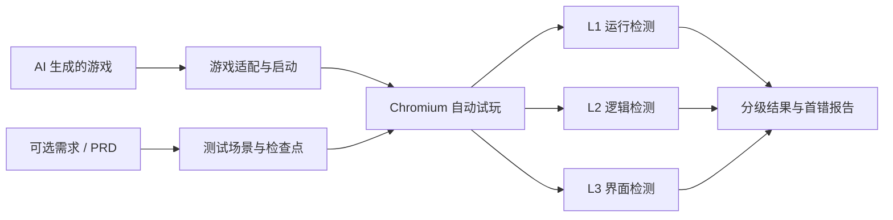

# GameTestLab

> 面向 AI 生成浏览器游戏的分级自动测试与首错定位。

GameTestLab 的重点是**检测手段**：在真实 Chromium 中操作已经生成好的浏览器游戏，判断它能否运行、核心逻辑是否正确、界面是否可用，并给出第一处失败证据。

**项目声明：本仓库是个人参加 2026 腾讯犀牛鸟开源人才培养计划相关活动的作品，不是腾讯或混元团队的官方项目。项目只通过 API 调用 Hy3，不训练、不微调，也不发布模型权重。**

[项目方案](docs/proposal.md) · [系统架构](docs/architecture.md) · [Pilot 结果](results/sample/README.md)

## 检测流程



PRD 只是生成测试场景的一种输入；没有 PRD 时，也可以由人工或规则预先定义启动、输入、推进、终局、重开和界面可见性场景。

## 三级检测手段

| 层级 | 检测内容 | 证据与工具 |
| --- | --- | --- |
| L1 运行 | 页面加载、启动、真实输入、console/page errors | Playwright + Chromium |
| L2 逻辑 | 状态转移、计分、事件、边界条件、完整游戏路径 | 动作轨迹、状态/事件流、Vitest oracle |
| L3 界面 | HUD 与内部状态一致、关键画面可见、视觉语义 | DOM、Canvas、截图、可选多模态判断 |

系统同时输出终局是否正确、过程是否正确和第一处偏离。即使最终结果碰巧正确，只要中间逻辑错误，也会标记为 lucky pass。

Vitest/jsdom 负责快速逻辑与 DOM 检查；真实可玩性认证必须来自无头 Chromium。

## 快速开始

环境：Node.js 22+、pnpm 10+。

```bash
pnpm install
pnpm exec playwright install chromium
pnpm run check
pnpm run test:browser
pnpm run eval:sample
```

查看示例游戏：

```bash
pnpm run demo:serve
# http://127.0.0.1:4173/examples/coin-collector/index.html
```

## 测试输入与输出

目标接入协议使用 `game.manifest.json` 描述入口、控件、界面 selector 和状态/事件结构。自动试玩仍使用真实键鼠输入，观察桥只负责 reset 和取证。

一次运行输出：

- `events.jsonl`：逐动作状态、事件、UI 和截图引用；
- `cases.json`：逐例 L1/L2/L3、终局、过程和首错；
- `summary.json`：正确率、定位、错误分布和难度拆分；
- `screenshots/`：可复核的画面证据。

若提供需求或 PRD，可用 Hy3 生成结构化测试建议：

```bash
cp .env.example .env
pnpm run hy3:probe
pnpm run hy3:plan -- \
  --prd examples/coin-collector/PRD.md \
  --case datasets/cases/clean-control/case.json
```

仓库也提供可选的 `hy3:generate`，用于生成实验对象；它不是项目的核心检测方法。

## 当前结果

当前 5 个 Coin Collector 变体用于校准评测器，覆盖 clean、终局错误、中间错误补偿、HUD 错误和跨层遮蔽。

- 20 项 Vitest 通过；
- 2 项真实 Chromium 测试通过；
- 冻结证据见 [results/sample](results/sample/README.md)。

这些结果只证明检测管线能识别预设故障，不代表 Hy3 的游戏生成能力。终稿前仍需加入多个独立生成游戏、人工抽检和两分钟 Demo。

当前 pilot 仍由预制 `case.json + oracle` 驱动；生成目录 adapter、无规格通用场景生成，以及多模态结果并入总报告，列入下一阶段。

## 目录

```text
src/runtime/       Chromium 自动试玩与证据采集
src/evaluation/    分层判定、首错、指标和视觉判断
src/contracts/     游戏、测试与结果契约
src/agents/        可选的 Hy3 测试规划与样本生成
datasets/          Pilot case 与 private oracle
tests/             Vitest、jsdom 和 Playwright 测试
docs/              方案、方法、数据与安全说明
results/sample/    已冻结的 Pilot 结果
```

详细排期见 [项目方案](docs/proposal.md)，赛题逐项映射见 [任务对照](docs/task-alignment.md)。

## License

代码及项目自建 fixture 使用 [MIT License](LICENSE)。外部游戏和素材需单独记录来源与许可证。
