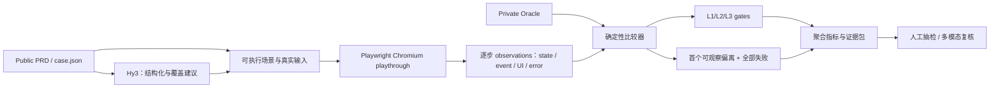
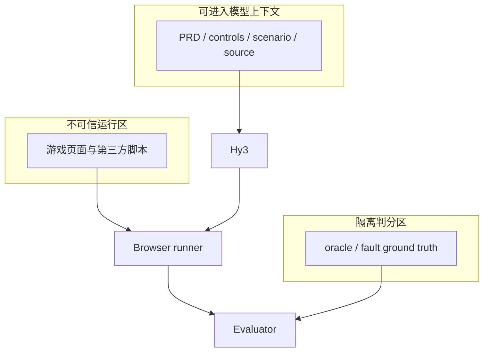

# 系统架构

PRD2Play 将“模型理解 PRD”和“硬性判分”拆开：Hy3 可以帮助结构化需求与解释错误，但最终判定由真实浏览器证据和隔离 oracle 决定。



图中 Hy3 输出不能读取 Private Oracle。即便 Hy3 不可用，确定性 sample 也能运行，用于验证评测基础设施；这种离线自检不是正式 Hy3 实验结果。

## 核心组件

### 1. 数据契约

`src/contracts/schemas.ts` 用 Zod 固定 public case、private oracle、observation 和 evaluation 的版本化结构。加载时先校验再执行，防止字段缺失被静默当成通过。

主要对象：

- `PublicCase`：游戏入口、控制映射、需求依赖、场景和难度；
- `PrivateOracle`：检查点期望、终局标志和人工故障真值；
- `Observation`：动作序号、检查点、内部状态、UI、事件、运行时错误和证据引用；
- `CaseEvaluation`：三层门、终局/过程正确性、首错及全部失败。

schema 采用显式版本，例如 `prd2play.case.v1`。字段语义发生不兼容变化时必须升级版本，而不是悄悄修改旧数据。

### 2. 游戏测试桥

被测游戏通过只读为主的最小适配器暴露 `window.__PRD2PLAY__`：

```ts
interface PRD2PlayBridge {
  protocol: "prd2play/1";
  isReady(): boolean;
  reset(options: { seed: number }): void | Promise<void>;
  observe(): GameObservation | Promise<GameObservation>;
  getEvents(options: { afterSeq: number }): GameEvent[] | Promise<GameEvent[]>;
}
```

桥只负责可观察性和确定性 reset，不替代真实玩家输入。开始、移动、点击仍由 Playwright 的键盘/鼠标 API 触发。这样可以检查输入链路，而不是直接调用游戏内部函数“伪造 playthrough”。

### 3. Playthrough runner

runner 为每个场景创建隔离页面，固定 viewport、locale、timezone 和 seed，然后：

1. 打开带 fixture variant 的游戏入口；
2. 收集 `pageerror` 和 console error；
3. 等待桥就绪并 reset；
4. 依次发送 `case.json` 定义的真实输入；
5. 每个动作后读取 bridge 状态/事件及 DOM/Canvas 证据；
6. 为该动作引用的每个 checkpoint 生成 observation；
7. 在安全前提下，即使首次失败也继续到终局。

页面崩溃、桥缺失、检查点缺失都必须形成失败证据，不能因“没有 observation”而被跳过。

### 4. 分层 evaluator

evaluator 逐项比较 oracle 期望与 observation，只比较 oracle 明确列出的路径。它区分：

- 第一次可观察偏离：证据最早不一致的 checkpoint；
- 根因需求：人工真值或后续诊断指向的 PRD requirement；
- 最终结果：最后一个 `terminal=true` 检查点；
- 过程正确性：所有检查点都无差异。

首个偏离并不总等于代码根因，所以结果字段不应将两者混写。

### 5. 指标与报告

聚合器从逐例 evaluation 与 fault ground truth 重算最终正确率、过程正确率、定位准确率、误报率、lucky-pass recall、错误分类 macro-F1 和难度拆分。报告只引用冻结产物，避免复制粘贴导致数字漂移。

## 信任边界



- 游戏页面、PRD 文本和模型输出均按不可信输入处理；
- oracle 对 Hy3 和被测页面不可见；
- API key 只存在于调用进程环境，不写入 artifact；
- 浏览器证据可以包含敏感画面，正式数据需要访问控制与保留策略。

## 可扩展点

- 不同游戏只需提供入口、控制映射和桥适配器；
- WebGL/复杂 Canvas 可以增加截图、OCR、像素或多模态 observation channel；
- 长路径可增加 checkpoint sampling，但终局和关键不变量不得被抽掉；
- 多场景/多 seed 应以独立样本计数，避免把相关运行误当成独立游戏；
- oracle 可移到独立服务，runner 只上传 observation，进一步降低泄漏风险。
