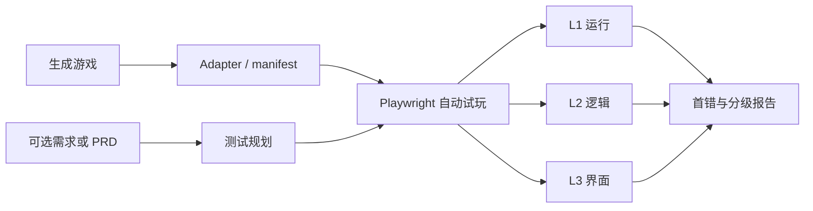

# 系统架构

GameTestLab 的目标输入是生成好的浏览器游戏。需求或 PRD 是可选测试依据，不是系统主角。

## 组件

| 组件 | 职责 |
| --- | --- |
| Game adapter | 描述入口、控件、viewport、UI selector 和状态/事件结构 |
| Test planner | 从可选需求/PRD 与通用可玩性规则生成场景和检查点 |
| Browser runner | 使用真实键鼠/触摸输入，采集错误、状态、事件、DOM、Canvas 和截图 |
| Evaluator | 执行 L1/L2/L3 门，比较 expected/actual，定位第一处偏离 |
| Metrics/report | 汇总终局、过程、错误类型、定位准确率、误报率和难度结果 |

## 证据原则

- Vitest 和 jsdom 只能作为快速检查，不能认证游戏真实可玩；
- 状态桥只用于 reset 和观察，不能代替真实玩家输入；
- 浏览器失败后在安全情况下继续路径，用于识别错误补偿；
- L2 已失败而画面表面正常时，L3 只能记为 `observed_not_certified`；
- 没有 PRD 时执行通用场景；有 PRD 时增加定制规则检查。

## 隔离

- 被测游戏运行在独立 browser context 和只读静态目录；
- private oracle、故障标签和 API key 不暴露给游戏；
- fixture 模式只服务 `/examples/**`，生成游戏使用单独的 `isolated-root`；
- 所有结果保存相对路径和 hash，方便复核。

## 当前边界

当前 pilot 已跑通预制 case/oracle 的完整浏览器路径；任意生成目录的 adapter、无规格通用场景生成和多模态结果聚合尚待接入。
