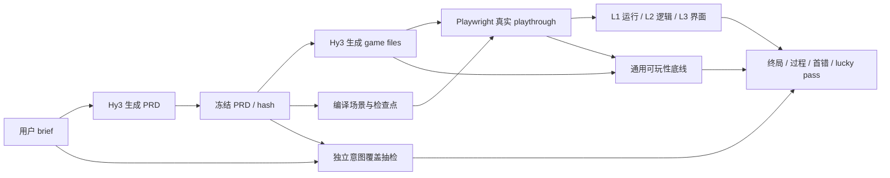

# 系统架构

PRD2Play 的入口是用户请求生成游戏。Hy3 先生成 PRD，PRD 冻结后再生成游戏；测试从冻结 PRD 编译，但 PRD 不是唯一真值，仍需独立检查它是否漏掉用户意图，并用通用规则检查基本可玩性。

## 组件职责

| 组件 | 职责 | 当前状态 |
| --- | --- | --- |
| 两阶段生成器 | `brief → PRD → game`，冻结 PRD 并保存请求、响应和 hash | 代码、CLI 和 mock 单测已实现；真实 Hy3 调用未执行 |
| 生成契约 | 校验 user brief、generated PRD、四文件 game package、manifest | `src/contracts/generation.ts` 已实现 |
| PRD 测试规划 | 从冻结 PRD 提取 requirement、scenario、risk 和 unknown | `hy3:plan` 已实现；真实调用未形成报告 |
| Browser runner | 用真实键鼠/触摸输入执行路径，采集 state、event、UI、error 和截图 | fixture pilot 已实现；生成包接入待实测 |
| Game bridge | 只提供 reset 和可观察证据，不替代玩家输入 | `window.__PRD2PLAY__` 已实现 |
| Evaluator | 比较 private oracle，执行 L1/L2/L3 门，输出终局、过程、首错和 lucky pass | fixture pilot 已实现 |
| 独立审核 | 检查 brief 覆盖、通用可玩性与自动定位误报 | 规则和正式人审尚未完成 |

## 两条审计记录

- **Generation trace**：原始 brief、PRD 请求/响应、冻结 PRD/hash、游戏请求/响应、game files/hash。
- **Play trace**：场景、真实动作、state/event/UI、runtime error、截图、checkpoint diff 与终局。

两条 trace 共同描述完整过程。自动首错目前只定位 play trace 中第一处可观察偏离；生成阶段根因另行分析，不能把浏览器首错直接说成某个生成步骤的根因。

## 信息边界

- 游戏生成只读取冻结 PRD，不读取 private oracle、故障标签或人审规则；
- fixture 服务器只暴露 `/examples/**`；生成游戏通过单独只读目录的 `isolated-root` 服务；
- API key 只在进程环境中使用，不写入请求快照、结果或日志；
- L1/L2/L3 主要判断 PRD 实现，brief 覆盖和通用可玩性需独立依据，缺少依据时明确记为未验证。

当前 coin-collector sample 是项目自建 evaluator fixture，不包含 AI 生成 PRD 或游戏，不能作为 Hy3 游戏生成成绩。
