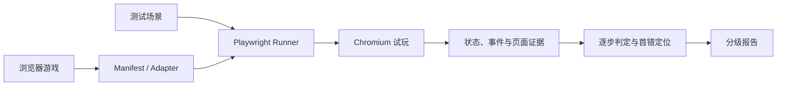

# GameTestLab 项目方案

> 更新时间：2026-08-29；作品终稿：2026-09-11

## 项目概述

不少生成游戏能打开页面，也能点击按钮，玩到中途才会暴露问题：得分没有更新、胜负条件走错，或者 HUD 和内部状态对不上。普通的启动测试抓不到这些错误。

游戏接入后，GameTestLab 会在 Chromium 中模拟玩家操作，记录整局过程，并给出可复现的测试结果。游戏文件、入口、操作方式和 viewport 由一个轻量 manifest 描述；有需求说明时，也可以据此补充特定玩法的场景与预期结果。

项目先覆盖结构相对清晰的单人网页小游戏，例如躲避、收集、点击和简单闯关类游戏。

## 设计思路

一次测试从真正打开页面开始。Playwright 发送键盘或鼠标输入，按预先定义的路径推进游戏，同时读取状态、事件、DOM、Canvas 和截图。测试动作不直接调用“加分”“胜利”等内部函数，避免出现测试通过、玩家操作却无效的情况。

结果按三个层次整理：

| 层次 | 回答的问题 | 主要证据 |
| --- | --- | --- |
| L1 运行 | 页面能否加载、开始并响应输入 | ready 状态、console、page error、runner 异常 |
| L2 逻辑 | 一局游戏是否按规则推进 | 动作轨迹、状态、事件、分数、胜负结果 |
| L3 界面 | 玩家看到的内容是否和状态一致 | DOM、Canvas、HUD、关键帧截图 |

L2 会检查整局过程。每个动作之后都设有检查点，系统会找到 expected 与 actual 第一次不一致的位置。这样既能指出“从哪一步开始错”，也能识别中途算错、后来又碰巧补回正确终局的 `lucky pass`。

界面检查会对照内部状态与 HUD，并保留开始、进行中、胜利或失败等关键画面。文字遮挡、关键元素缺失等视觉问题可以交给多模态模型辅助判断，但原始截图和结构化证据会一并保留，便于人工复核。

## 系统架构

Runner 负责浏览器启动、输入回放和证据采集；Evaluator 按检查点完成判定；Reporter 汇总分级结果、首错位置和复现信息。各部分使用统一的数据格式，后续接入新的游戏时主要补充 manifest、adapter 和场景，不必改动执行器。

## 重点技术

浏览器执行采用 Playwright 和无头 Chromium。Vitest 与 jsdom 用于纯逻辑、数据契约和 DOM 规则的快速测试，不承担真实可玩性的结论。

游戏侧通过 `game.manifest.json` 声明入口、控件、viewport、selector 和可观察状态。观察桥只提供 reset 与取证能力，玩家动作始终从浏览器输入进入。

每一步保存输入、状态、事件、UI 信息和截图引用。某个检查点失败后，测试仍会在安全范围内继续，以便判断错误是否持续、是否影响终局，以及后续是否出现补偿。

为了便于复现，报告记录 case、seed、浏览器信息、动作轨迹和文件 hash。oracle 与游戏实现隔离，API key 不进入被测页面。若提供玩法描述，Hy3 可将其整理成测试场景草案，expected/oracle 冻结或人工确认后再执行。

## 预期效果

对每个游戏给出 L1、L2、L3 的通过情况，同时区分过程正确性和终局正确性。失败报告应能指向第一个异常动作，并附上当时的状态、事件和页面证据，而不是只返回一条笼统的“测试失败”。

实验阶段将统计各层通过率、首错定位准确率、误报率和不同难度场景下的表现，并抽取部分结果人工复核。

## 当前进展

目前已经完成 TypeScript 测试框架、数据契约、结果格式、Playwright 自动试玩和证据采集。5 个预设故障变体用于校准过程判定、终局判定和首错定位；20 项 Vitest 与 2 项 Chromium 测试已通过，并保存了一组可重复运行的 Pilot 结果。

现有样例验证的是测试管线能否识别已知故障。下一步会接入多个独立生成的游戏，再评估对不同实现方式和未知错误的适应能力。

## 时间安排

| 时间 | 工作内容 |
| --- | --- |
| 8/29—8/31 | 固化 manifest、adapter 和结果格式 |
| 9/1—9/3 | 接入多个独立生成游戏，补充完整 playthrough |
| 9/4—9/6 | 完善首错、lucky pass、边界路径和界面检查 |
| 9/7—9/8 | 运行正式实验，完成人工抽检与误报分析 |
| 9/9—9/10 | 汇总结果，整理文档并录制两分钟演示视频 |
| 9/11 | 全量复测，整理终稿并提交 |

## 风险与处理

不同游戏的状态结构和控制方式差异较大，先通过 manifest 与 adapter 做隔离；确实无法读取内部状态时，退回事件、DOM、Canvas 和截图证据，并在报告中说明置信范围。

随机性可能造成结果波动，因此固定 seed、保存动作轨迹并进行多次重放。视觉判断以结构化检查为基础，多模态结果只作为辅助。运行未知游戏时限制静态目录与网络能力，并为每个 case 使用独立浏览器上下文。

## 交付内容

最终提交包括可运行源码、测试场景、冻结结果、方案和实验分析，以及一段展示“载入游戏—自动试玩—发现异常—查看首错证据”的演示视频。
