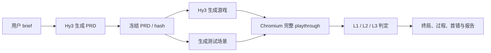

# 任务二项目方案：PRD2Play

> 方案日期：2026-08-28
>
> 节点：8 月 27 日方案文档，9 月 11 日作品终稿，9 月下旬公示
>
> 项目性质：个人活动作品，非腾讯或混元官方项目

## 1. 项目目标

PRD2Play 面向“用户让 AI 生成浏览器游戏”的场景：Hy3 先根据用户需求编写 PRD，再根据冻结 PRD 生成游戏。系统随后在真实 Chromium 中完成游戏路径，检查游戏能否运行、逻辑是否符合 PRD、界面是否正确，并定位第一次偏离。

PRD 只是中间契约。系统还会检查 PRD 是否遗漏用户明确要求，避免一份残缺 PRD 与游戏互相自洽却仍被判为成功。

项目只调用 Hy3 API，不训练或微调模型。

## 2. 设计思路

一次样本保留两类记录：

- Generation trace：用户 brief、PRD 请求/响应、冻结 PRD、游戏请求/响应和生成文件；
- Play trace：真实动作、状态、事件、UI、运行错误、截图和检查点差异。

### 三级测试

| 层级 | 检查内容 | 证据 |
| --- | --- | --- |
| L1 运行 | 页面加载、启动、输入和运行时错误 | Chromium、console/page errors |
| L2 逻辑 | 状态转移、计分、事件和终局 | 状态桥、事件流、PRD 检查点 |
| L3 界面 | HUD/画面是否与内部状态一致 | DOM、Canvas、截图、可选多模态 |

系统分别报告 `final_outcome_correct` 和 `process_correct`。如果终局正确但中间过程错误，则标记 lucky pass，并继续保留后续轨迹。

## 3. 系统组成

| 模块 | 作用 | 当前状态 |
| --- | --- | --- |
| 两阶段生成器 | `brief → PRD → game`，冻结 PRD 并保存 hash | 代码和 mock 单测完成；真实 Hy3 待运行 |
| PRD 测试规划器 | 从 PRD 提取需求、场景和检查点 | 已实现接口；正式实验待运行 |
| 浏览器 Runner | 用真实键鼠输入执行完整路径 | 已用 fixture 验证 |
| Evaluator | L1/L2/L3、首错、错误分类和 lucky pass | 已实现并测试 |
| Visual Judge | 可选截图语义判断 | 接口已实现，未配置时为 `unverified` |
| Report | 汇总最终/过程正确率、定位、误报和难度结果 | Pilot 产物已生成，正式报告待完成 |

## 4. 重点技术

### 4.1 PRD 冻结与可追溯

第一次 Hy3 调用只生成 PRD；校验后保存冻结文件和 SHA-256。第二次调用只根据该冻结版本生成游戏，不能事后修改 PRD 迎合代码。两次请求和响应分别留档，API Key 不写入产物。

### 4.2 真实浏览器测试

Vitest 和 jsdom 负责快速单元测试；最终可玩性由 Playwright + Chromium 判断。动作必须通过真实点击、键盘或触摸事件进入游戏，状态桥只用于 reset 和取证。

### 4.3 首错定位

每次动作后记录状态、事件、DOM、Canvas 和截图。Evaluator 按 PRD 检查点比较 expected/actual，输出第一处失败及全部后续失败，因此能够识别最终结果碰巧正确的补偿错误。

### 4.4 信息隔离

生成模型看不到 private oracle 和故障标签；生成游戏只在独立只读目录中运行；真实密钥只从环境变量读取。公开 pilot 的 oracle 仅用于复现，不用于正式盲测。

## 5. 预期效果

终稿目标：

1. 跑通真实 `brief → PRD → game → playthrough → report`；
2. 至少覆盖 D1/D2/D3 和多个独立生成游戏；
3. 输出最终正确率、过程正确率、首错定位、错误分布和难度拆分；
4. 用人工抽检验证定位准确率与 clean 误报率；
5. 提供不超过两分钟的演示视频或 GIF。

当前已完成：两阶段生成代码、数据契约、5 个 evaluator fixture、20 项 Vitest、2 项 Playwright 测试、实际 Chromium pilot 与冻结结果。

当前未完成：真实 Hy3 生成实验、生成 PRD 到可执行案例的自动衔接、多游戏数据、人审和 Demo。Pilot 数字不代表 Hy3 生成能力。

## 6. 时间安排

| 日期 | 工作 | 完成标准 |
| --- | --- | --- |
| 8/28 | 范围和方案冻结 | 明确 brief→PRD→game 主链，仓库和方案可提交 |
| 8/29–8/31 | 最小端到端链路 | 用真实 Hy3 生成至少一个游戏并接入浏览器测试 |
| 9/1–9/3 | 数据扩展 | 准备多条 brief、D1/D2/D3 场景和独立游戏 |
| 9/4–9/6 | 批量实验 | 冻结 prompt/数据，运行生成与 playthrough，保留全部失败 |
| 9/7–9/8 | 人工抽检与指标 | 核对首错、错误类型和误报率，生成分层结果 |
| 9/9 | 报告与复现 | 从冻结 JSON/JSONL 产物核对全部数字 |
| 9/10 | Demo 与安全审计 | 完成 ≤120 秒成片，检查密钥、许可和 oracle 泄漏 |
| 9/11 | 发布 | 冻结 commit/tag、结果、报告和演示材料 |

## 7. 风险与兜底

| 风险 | 处理方式 |
| --- | --- |
| Hy3 额度或端点不稳定 | 先做小规模 probe；保留失败记录与重试规则，不伪造结果 |
| 浏览器测试抖动 | 固定 seed、viewport 和时区；基础设施失败单独统计 |
| 数据量不足 | 优先保证完整证据链和多个独立游戏，不用同一 fixture 变体冒充大数据 |
| 多模态不可用 | L3 语义检查记为 `unverified`，改用截图和人工复核 |
| Oracle 或密钥泄漏 | 立即撤销密钥、隔离受影响样本并重新划分盲测集 |

## 8. 最终交付物

- 公开源码、README、环境样例和开源许可；
- Hy3 两阶段生成器与脱敏 generation trace；
- 分层数据、private oracle 和校验脚本；
- Chromium playthrough、逐动作证据和自动判分；
- 结果、人工抽检记录、分析报告和 ≤2 分钟 Demo。

详细实现见 [系统架构](architecture.md)，逐项验收见 [赛题对照](task-alignment.md)。
