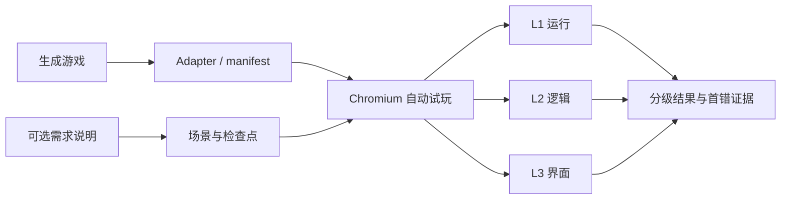

# GameTestLab 项目方案

> 更新时间：2026-08-29；作品终稿：2026-09-11

## 一、项目目标

GameTestLab 面向 AI 生成的浏览器游戏，重点研究**如何自动检测游戏是否真正可玩**。

系统接收已经生成好的游戏，通过真实浏览器完成游戏路径，并回答三个问题：

1. 游戏能否正常加载、启动和响应输入；
2. 游戏过程与核心规则是否正确；
3. 界面是否正确呈现状态并支持玩家理解。

测试输入包括游戏文件、入口和控件描述。需求说明或 PRD 为可选依据，只用于补充定制场景，不影响通用检测。

## 二、总体架构

一次检测由“启动游戏—执行真实输入—采集过程证据—逐级判定—生成报告”组成。

## 三、核心检测手段

### L1：运行检测

L1 判断游戏是否具备最基本的可运行性：

- 页面和静态资源能否成功加载；
- 游戏能否进入可操作状态；
- 键盘、鼠标或触摸输入是否生效；
- 是否出现 console error、page error 或资源错误；
- 游戏是否能完成重置或重新开始。

检测在无头 Chromium 中进行。只有页面真实加载并响应输入，才判定为 L1 通过。

### L2：逻辑检测

L2 通过完整 playthrough 检查游戏规则和状态转移：

- 将场景拆为动作、检查点和预期结果；
- 使用真实玩家输入推进游戏，不直接调用得分或胜负函数；
- 每一步记录状态、事件、分数和终局信息；
- 同时检查中间过程与最终结果；
- 覆盖正常路径、失败路径、边界条件和重新开始。

系统逐步比较 expected 与 actual，定位第一次偏离发生在哪个动作之后。

如果中间过程出错，但后续补偿使最终结果碰巧正确，报告将其标记为 `lucky pass`，避免只看终局造成漏检。

### L3：界面与多模态检测

L3 检查玩家看到的界面是否与游戏内部状态一致：

- 比较 HUD 中的分数、生命、倒计时与实际状态；
- 检查开始、进行中、胜利、失败等关键画面；
- 采集 DOM、Canvas、截图和 viewport 信息；
- 检查文字遮挡、关键元素缺失和明显布局异常；
- 必要时用多模态模型判断视觉语义和可理解性。

多模态判断是可复核的辅助信号，不单独决定是否通过。L2 失败时，表面正常的截图也不会掩盖逻辑错误。

## 四、重点技术

- **真实浏览器**：Playwright 驱动 Chromium 执行输入和完整路径，负责可玩性认证；
- **快速检查**：Vitest 与 jsdom 测试纯逻辑、契约和 DOM 规则，但不替代浏览器；
- **轻量适配**：`game.manifest.json` 描述入口、控件、viewport、selector 和状态结构；
- **过程取证**：每个动作保存输入、状态、事件、UI 和截图引用，失败后安全续跑；
- **可选规则**：Hy3 可根据需求提出场景建议，expected/oracle 来自冻结规则或人工确认；
- **复现隔离**：记录 case、seed、轨迹、浏览器信息和 hash，并隔离 oracle 与 API key。

观察桥只负责 reset 与取证，不参与玩家动作，以免测试绕过真实交互。

## 五、预期效果

- 为生成游戏给出 L1、L2、L3 分级结果，区分运行、逻辑和界面错误；
- 同时报告过程正确性与终局正确性；
- 定位第一处失败并保留可复核证据；
- 统计通过率、定位准确率、误报率和难度表现。

## 六、当前状态

- 已完成 TypeScript 检测框架、数据契约、结果格式和三级判定；
- 已完成 Playwright + Chromium 自动试玩、证据采集和首错定位；
- 已用 5 个故障变体校准检测器；
- 当前 20 项 Vitest 与 2 项真实浏览器测试通过；
- 已冻结 Pilot 结果，便于后续对照和复核。

当前样例只证明检测管线能识别预设故障，不代表模型的游戏生成能力。

## 七、时间规划

| 时间 | 工作内容 |
| --- | --- |
| 8/29—8/31 | 固化适配协议和三级判定规则 |
| 9/1—9/3 | 接入多个独立生成游戏，补充 playthrough 场景 |
| 9/4—9/6 | 完善首错、lucky pass、边界路径和界面检测 |
| 9/7—9/8 | 运行正式实验，完成人工抽检与误报分析 |
| 9/9—9/10 | 汇总结果，完成报告和两分钟演示视频 |
| 9/11 | 全量复测、整理终稿并提交 |

## 八、风险与应对

- **实现差异大**：用 manifest 和 adapter 隔离框架差异；
- **状态不可见**：降级到事件、DOM、Canvas 和截图，并标注置信范围；
- **随机性波动**：固定 seed，多次重放并保存动作轨迹；
- **视觉判断不稳定**：以结构化检查为主，多模态仅作辅助；
- **时间与安全**：先保证 L1、L2 和证据链；限制静态目录、网络能力并使用独立上下文。

## 九、交付物

最终提交包括可运行源码、测试数据、冻结结果、方案与分析文档，以及展示“输入游戏—自动试玩—分级判定—首错证据”的演示视频。
