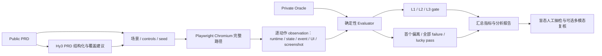

# 任务二项目方案：PRD2Play 浏览器游戏过程评测与首错定位

> - 方案版本：v0.1-proposal
> - 编写日期：2026-08-28
> - 对应节点：8 月 21 日启动会、8 月 27 日方案文档、9 月 11 日项目终稿、9 月下旬结果公示
> - 项目性质：个人活动作品，非腾讯或混元官方项目

## 一、项目定位

本项目选择任务二“大模型生成内容的过程质量评测与错误定位”，把研究对象落到**浏览器游戏生成与可玩性测试**。

游戏生成结果不能只靠“页面能打开”或“最后显示胜利”判断。一个生成游戏可能在第一次收集道具时多加 1 分，随后又少加 1 分，最终分数碰巧正确；也可能内部逻辑正确，但 HUD 一直显示旧值。传统终局测试会漏掉这些过程错误。

PRD2Play 的目标是：从自然语言 PRD 建立可审计的分层测试，在无头 Chromium 中通过真实键鼠输入完成一条完整 playthrough，逐动作采集状态、事件和 UI 证据，判断最终结果与过程是否分别正确，并定位第一处可观察偏离及其错误类型。

项目仅通过 OpenAI-compatible API 调用 Hy3，使用其进行 PRD 结构化与测试覆盖建议，不训练、不微调模型。标准答案由独立 oracle 和确定性比较器掌握，避免让模型同时出题和判题。

## 二、设计思路

### 2.1 核心问题

项目回答四个问题：

1. 生成游戏能否在真实浏览器中启动并接收玩家输入？
2. 完整路径上的每次状态转移、规则效果和终止条件是否符合 PRD？
3. 内部逻辑和玩家可见 UI 是否一致？
4. 如果失败，第一处有证据的偏离在哪里；是否存在“终局正确、过程错误”的幸运通过？

### 2.2 核心设计

**设计一：Public PRD 与 Private Oracle 分离。** `case.json` 包含可公开给 Hy3 的需求、控件和场景；`oracle.private.json` 保存每个检查点的期望值和故障真值，禁止进入模型上下文。公开 pilot 为了复现而附带 oracle，正式盲测必须隔离存储。

**设计二：真实输入驱动的完整 playthrough。** Vitest 和 jsdom 用于快速验证纯逻辑与 DOM 辅助代码；真正的游戏认证由 Playwright + 无头 Chromium 完成。测试通过页面点击和键盘事件操作游戏，不直接调用内部业务函数。

**设计三：L1/L2/L3 分层门。** L1 检查页面、运行时和输入；L2 检查状态、事件和游戏规则；L3 检查 HUD/画面与内部状态的一致性，并预留截图多模态复核。低层失败会阻断高层认证，防止“画面看起来对”掩盖逻辑错误。

**设计四：终局与过程双指标。** 系统同时输出 `final_outcome_correct` 和 `process_correct`。前者正确、后者错误时标记 lucky pass，并保留首错后的后续路径，以识别错误补偿。

**设计五：首错与根因分开。** 第一处可观察偏离由 checkpoint 证据确定；根因对应需求和代码原因，可能需要人工或模型进一步解释。项目不把二者混成一个模糊“出错步骤”。

### 2.3 难度分级

- D1：短路径、单一直接错误；
- D2：多步依赖、延迟错误或错误补偿；
- D3：跨层遮蔽、UI/逻辑不一致或需要截图复核。

测试层级描述“检查什么”，难度描述“定位有多复杂”，两个维度独立统计。

## 三、系统架构



### 3.1 模块说明

| 模块 | 责任 | 主要技术/产物 |
| --- | --- | --- |
| PRD planner | 将公开 PRD 转成带 L1/L2/L3 的结构化测试建议 | Hy3 API、Zod、`plan.json`、脱敏 manifest |
| 数据契约 | 校验 case、oracle、observation、evaluation | TypeScript、Zod、版本化 schema |
| Browser runner | 启动静态服务、发送真实输入、采集逐步证据 | Playwright Chromium、固定 seed/viewport |
| Game bridge | reset 并只读观察内部状态/增量事件 | `window.__PRD2PLAY__` 协议 |
| Evaluator | 检查 checkpoint、三层门、首错和 lucky pass | 确定性路径比较、错误 taxonomy |
| Visual judge | 对截图做可选语义判断，不确定时拒绝硬判 | OpenAI-compatible 多模态 API；未配置为 `unverified` |
| Metrics/report | 汇总最终/过程/定位/误报/难度结果 | JSON/JSONL、人审 CSV、Markdown 报告 |

### 3.2 数据流与信息边界

Hy3 只能看到 PRD、公开 controls、surface 和难度信息；不能看到 oracle、预设故障标签或期望状态。被测网页只能由静态服务器访问 `/examples/**`，不能通过 HTTP 读取 datasets、环境变量或评测器文件。API key 只存在于进程环境，不进入提示词产物和日志。

## 四、重点技术

### 4.1 Hy3 结构化计划

`hy3:plan` 把 PRD 和公开控制映射发给 Hy3，要求返回固定 JSON schema：requirements、scenarios、risks、unknowns。返回结果必须通过 Zod；请求/响应各自记录 SHA-256，manifest 记录模型与推理档位但不保存密钥。

这条链路的价值是让模型处理自然语言需求和覆盖盲点，而把“是否通过”留给可复现规则。到 8 月 28 日，代码接口已经实现；尚未把真实 Hy3 调用结果写成正式实验结论。

### 4.2 真实浏览器与确定性复现

Runner 为每个 case 建立隔离 browser context，固定 seed、viewport、locale 和 timezone；Playwright 发送真实键鼠/触摸事件。桥接协议只提供 `isReady`、`reset`、`observe` 和 `getEvents`，不会绕过输入层直接移动角色。

每个动作后生成 state hash、增量事件、DOM/HUD、Canvas 基础证据、浏览器错误和截图。首次失败后在安全前提下继续到终局，以捕获补偿错误。

### 4.3 分层判分与错误定位

Evaluator 只比较 oracle 明确声明的路径，输出：

- `gates.L1/L2/L3` 与 `highest_certified_level`；
- `final_outcome_correct`、`process_correct`、`lucky_pass_detected`；
- `first_failure` 与 `all_failures`；
- runtime/state/UI/event 的 expected/actual diff；
- 版本化错误标签，如 runtime、state effect、terminal、missing event、state–UI inconsistency。

### 4.4 多模态与人工验证

L3 先做确定性的 DOM、可见性和状态一致性检查；复杂画面语义可以调用可选多模态 judge。配置缺失时必须输出 `unverified`，置信不足时输出 `uncertain`，不默认通过。正式报告用分层盲态人工抽检核查首错准确率和 clean 误报率，并记录双人分歧与裁决。

### 4.5 可审计产物

sample runner 生成：

```text
artifacts/runs/<run-id>/
├── events.jsonl
├── cases.json
├── summary.json
└── screenshots/<case>/*.png
```

`latest.json` 只作为最近运行指针；正式结果以不可变 run ID 和文件 hash 为准。

## 五、预期效果与验收标准

这里的“预期”是 9 月 11 日前的验收目标，不是已经测得的数值。

| 目标 | 验收方式 | 当前证据级别 |
| --- | --- | --- |
| 新环境能运行完整 sample playthrough | `check`、Chromium test、`eval:sample` 均通过 | 本机已生成 pilot snapshot；跨环境以最终 CI 为准 |
| 能区分终局正确与过程正确 | 补偿错误样例终局通过但过程失败 | 单测和项目自建 pilot 可验证，不外推 |
| 能定位第一处可观察偏离 | 输出 checkpoint、动作、需求、错误类型和 diff | 已有 evaluator 与测试；真实游戏待扩展 |
| L1/L2/L3 不越级认证 | 低层失败时高层 blocked/observed-not-certified | 已有 gate 设计与单测 |
| 结果可追溯 | 每次 run 保存逐动作、逐例、汇总和截图证据 | sample 产物格式已实现 |
| 验证定位准确率和误报率 | 冻结数据后双人盲审，报告分子/分母/分歧 | 尚未完成，9 月 7–9 日执行 |
| 使用 Hy3 完成正式实验链路 | 保存脱敏的请求/响应 hash、计划和 manifest | 接口已实现，真实调用证据待执行 |
| 提供 ≤2 分钟 demo | 现场展示真实输入、首错和 lucky pass | 尚未录制 |

项目不预设“准确率必须达到某个好看百分比”。如果正式样本量不足，终稿将报告原始计数和限制，不用 pilot fixture 的设计真值冒充模型性能。

## 六、截至 8 月 28 日的真实进度

| 项目 | 状态 | 说明 |
| --- | --- | --- |
| TypeScript 仓库、配置、许可、密钥样例 | 已实现 | 个人/非官方/仅 API 声明已写入 README |
| 数据 schema 与加载器 | 已实现 | case/oracle/evaluation 均版本化校验 |
| 5 个项目自建 pilot case | 已实现 | 含 clean、wrong-final、lucky-pass、UI-only、跨层遮蔽；不是正式 benchmark |
| 数据校验与 Vitest/jsdom 单测 | 已实现 | 覆盖数据引用、首错、指标、HUD |
| Playwright runner、静态服务、sample artifact | 已实现并完成本机 pilot run | 已生成逐动作、逐例、汇总和 15 张截图；跨环境仍需 CI 复核 |
| 静态服务 oracle 隔离 | 已实现 | HTTP 严格限制为 `/examples/**`；Node evaluator 直接读取数据 |
| Hy3 client、probe、PRD planner | 代码已实现，真实实验未完成 | 不声明 endpoint 成功率或计划质量 |
| 可选多模态 screenshot judge | 接口已实现，未实测 | 未配置时返回 `unverified` |
| GitHub CI | 工作流已编写，线上未验证 | 首次 push 后以实际 workflow 为准 |
| 人工抽检、误报验证 | 未执行 | `human-review.csv` 只有待审核行，模板已准备，不填虚构数字 |
| 正式分析报告和 demo | 未完成 | 报告当前为模板，demo 尚无媒体文件 |

## 七、8 月 28 日—9 月 11 日排期

| 日期 | 里程碑 | 当日完成定义 |
| --- | --- | --- |
| 8/28 | 方案与仓库骨架冻结 | 提交本方案、README、任务对照；所有“已实现/待实现”表述审计一致 |
| 8/29 | 一键复现与 CI | 干净环境完成 install/check/browser/sample；修复跨平台路径与超时；生成首份非正式 run |
| 8/30 | Hy3 主链路实测 | 完成 probe 与至少一例 PRD plan；保存脱敏 manifest、prompt/response hash，确认 oracle 未进入请求 |
| 8/31 | 游戏适配边界验证 | 在第二个独立 fixture 或许可清晰的开源小游戏上验证 bridge/controls，不只复用 coin collector mutation |
| 9/1 | 正式数据设计评审 | 冻结游戏家族、D1/D2/D3、错误类型、clean 比例、路径与 seed 的抽样表 |
| 9/2 | 数据扩展 I | 完成 L1/L2 为主的用例、来源许可和 oracle 初标；保留原生 Hy3 失败 |
| 9/3 | 数据扩展 II | 完成 L3/跨层/补偿用例，生成截图证据；未可用多模态明确记 unverified |
| 9/4 | Oracle 双审与冻结 | 两人独立核对标准答案、首错、根需求和标签；解决分歧并记录 hash |
| 9/5 | 批量 Hy3/浏览器运行 | 使用冻结 prompt、数据与 commit 批量运行；保留全部 artifact 和基础设施失败 |
| 9/6 | 失败重现与 taxonomy 审计 | 重现异常 run，区分 runner/游戏责任；taxonomy 变更需版本化，不覆盖旧结果 |
| 9/7 | 盲态人工抽检 | 按预注册分层抽样，双人盲审 clean 报错、faulty 与 lucky-pass |
| 9/8 | 指标与能力断点分析 | 生成最终/过程、exact/±1、FPR、macro-F1、难度拆分；小分母报告计数 |
| 9/9 | 报告初稿与独立复现 | 从冻结 JSON 自动核对全部数字；在第二环境复现核心案例并记录差异 |
| 9/10 | Demo、文档与安全审计 | 完成 ≤120 秒视频/GIF；secret/license/oracle 泄漏检查；README 最终校对 |
| 9/11 | 终稿发布缓冲 | 只修阻塞问题；打 tag，冻结 commit、证据包、报告和媒体，完成提交 |

每日结束保留可运行 commit。9 月 5 日后不再为提高分数修改正式测试集；必要修复通过新版本和完整重跑完成。

## 八、风险与兜底

| 风险 | 影响 | 预防 | 兜底方案 |
| --- | --- | --- | --- |
| Hy3 端点或额度不稳定 | 无法完成正式调用 | 8/30 前完成连通性和小批量预算测试；缓存脱敏请求与 hash | 保留重试窗口与本地自托管方案；确定性 sample 可继续开发，但终稿必须明确未完成 Hy3 实验，不能伪造 |
| 浏览器测试抖动 | 误判逻辑、CI 偶发失败 | 固定 seed/viewport/timezone，等待明确状态，隔离 context | 将基础设施失败单列；只按预先规则重跑并保留原 run |
| 时间不足以扩展大数据 | 结论外部效度低 | P0 先保证完整证据链，P1 再扩游戏数 | 缩小问题范围，诚实提交 method + pilot，不声称广泛 benchmark |
| 多模态服务不可用/结果不稳 | D3 语义 UI 不完整 | 确定性 DOM/Canvas 证据为基础，保留 screenshot | 多模态记 `unverified`，改用双人人审；不把 L3 默认判 pass |
| Oracle 泄漏 | 正式分数失效 | prompt 只读 public case；服务只暴露 examples；保存请求 hash | 受影响样本退出盲测，重新划分保留集并记录事件 |
| 开源游戏许可不清 | 无法公开数据/媒体 | 只选明确 MIT/Apache 等许可并固定 commit、素材来源 | 回退到项目自建 fixture；不重新分发无授权资产 |
| 错误 taxonomy 主观 | 分类 F1 不可信 | 给出边界、正反例，双人独立标注 | 保留 `unknown` 与原预测，报告分歧，不强行归类 |
| API key/截图泄漏 | 安全与合规风险 | 环境变量、Git ignore、日志脱敏、录屏前清空通知 | 立即撤销轮换、移除 artifact、审计 Git 历史并披露影响范围 |

### P0 / P1 取舍

P0（必须完成）：Hy3 真实调用证据、真实浏览器完整路径、分层 oracle、首错/lucky-pass、数据与结果脚本、实际结果、人工抽检、分析报告、≤2 分钟 demo、密钥与许可证审计。

P1（资源允许）：更多游戏引擎、大规模多 seed、多模态自动评审、交互式结果面板。P1 不得挤占 P0 的可复现性和真实验证。

## 九、最终交付物

1. 公开源码、运行配置、环境说明与开源许可；
2. Hy3 PRD planner 与脱敏调用 manifest；
3. 分层数据集、标准答案、来源/许可/难度说明和校验脚本；
4. Playwright 完整路径 runner、Vitest/jsdom 单测与 CI；
5. 逐动作证据、逐例结果和聚合 summary；
6. 定位准确率、误报率、人审分歧与裁决记录；
7. 最终正确率、过程正确率、错误分布、难度拆分和能力断点分析；
8. 不超过两分钟的演示视频或 GIF；
9. README 中的个人活动作品、非官方、仅调用 Hy3 API、不训练/微调及密钥安全声明。

详细验收映射见 [task-alignment.md](task-alignment.md)，评测定义见 [evaluation-method.md](evaluation-method.md)，报告在 `reports/` 完成真实运行后填写。
