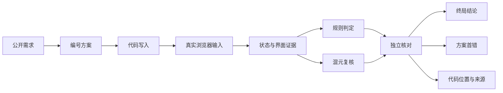

# GameTestLab：面向网页游戏生成的过程评估与错误定位

## 摘要

现有网页游戏生成评测通常检查页面能否打开，或比较少量终局状态。这类方法无法回答两个问题：游戏是否沿着合理过程到达结果，以及生成前的实现方案从哪一步开始失效。GameTestLab 将混元生成的浏览器游戏作为可验证代码任务，保存公开需求、编号方案、代码写入、真实输入和运行状态，再以可执行规则和混元复核共同检查游戏结果与生成过程。正式实验从 96 道候选任务中按冻结顺序选取 15 题，覆盖 4 个难度为 D1、6 个 D2、5 个 D3。15 个游戏包含 47 条玩法路径，每条在独立 Chromium 环境中执行 3 次，共 141 次运行。当前接口声明合规 8/15，原固定路径到达预期终点 14/47；后者受测试时机和断言错误影响，只作为原始执行记录。对三个具有独立标准的方案错误，原混元复核同时判错并定位正确步骤 1/3；补充实验还识别出一个“核心玩法正确、方案说明错误”的 2048 样本。实验表明，真实输入、状态探针和时间控制能够把游戏缺陷、方案错误与测试问题分开，但现有有效性样本不足以估计总体定位率、误报率或难度临界点。

关键词：混元；代码生成；浏览器游戏；过程评估；错误定位；Playwright

## 1. 研究问题

网页游戏的终局状态不能完整反映玩法质量。角色可能在中途穿过平台，HUD 可能在失败后仍显示进行中，旧计时器可能在重开后继续修改新一局状态；这些错误有时不影响终局的 `won` 或 `lost`。单纯检查终局会漏掉中间偏差，也无法说明错误来自需求理解、生成方案、代码实现还是测试脚本。

本项目将“过程”限定为模型实际输出并可保存的外部材料，包括代码生成前的编号方案、文件写入记录和游戏运行轨迹，不推断模型未公开的内部思维。实验围绕三个问题展开：真实浏览器证据能否验证生成游戏的玩法过程；方案、代码和运行记录能否支持首错定位；所设计的评估器能否用独立标准检验定位命中与误报。

GameTestLab 的主要工作不在于提出新的游戏生成模型，而在于增加一个可核对的评估维度。系统把终局、过程和测试标准分开记录，避免将“路径失败”直接写成“模型生成失败”，也避免用混元自己的判断充当唯一标准答案。

项目形成三项可复验交付：一套包含状态、事件、界面、时间与物理探针的浏览器执行工具；一套连接公开方案、代码写入和运行轨迹的过程评价方法；一组保留原始模型记录、重复运行和独立对照的 15 题实验材料。三项交付分别对应玩法是否成立、错误从何处出现以及评估器判断是否可信。

## 2. 任务与数据

### 2.1 任务形式

每道题要求生成一个可以直接在浏览器运行的完整游戏。公开需求包含玩法目标、胜负条件、重开规则、控件和观察接口。混元先输出 3 至 8 步的编号方案，再生成 HTML、CSS、JavaScript 和 `game.manifest.json`。生成阶段看不到私有预期结果；测试路径、检查点和正确值只在代码生成完成后进入执行程序。

候选题库共有 96 题，按动作、益智、创意、模拟和教育五类构造。原集合中的摄像头、视频理解和语音输入任务被移出范围；DOM、Canvas、3D、多人、持久化、排行榜和触控任务保留。题目不是对已有提问的逐条复制，而是依据玩法分布重新编写完整规则。题库构造、许可和适用范围见[数据卡](../docs/dataset-card.md)。

### 2.2 难度与正式子集

D1 以短规则链和直接状态转换为主；D2 引入多阶段目标、计时或边界条件；D3 涉及多页面、持久化、复杂交互或物理过程。正式实验在生成结果揭晓前固定候选题库中的前 15 题，避免按成功与否挑选样本。前 5 题复用已经完成且保留原始调用记录的游戏，后 10 题按相同流程新生成。

| 维度 | 构成 |
| --- | --- |
| 难度 | D1 4 题，D2 6 题，D3 5 题 |
| 玩法 | 动作 6 题，益智 5 题，创意 2 题，模拟 2 题 |
| 排除任务 | 摄像头、视频理解、语音交互 |
| 游戏总数 | 15 |
| 玩法路径 | 47 |
| 重复运行 | 每条路径 3 次，共 141 次 |

正式子集没有教育类任务，难度与玩法构成也不是正交设计。分层结果只能描述当前样本，不能代表 96 题候选库的总体分布。

## 3. 过程评估方法

### 3.1 证据链

评价单位是编号方案中的一条可检验主张，例如“按下按钮后增加 25 分”“重开后时钟归零”或“角色从当前平台能够到达目标平台”。一条主张依次经过公开规则、独立判据、最终代码和浏览器轨迹核对。混元负责阅读需求、方案、代码与执行证据并给出复核意见；可执行规则、地图坐标、算术关系和真实输入负责检验该意见是否成立。



系统区分三种位置。操作首错是轨迹中第一次可观察偏差；方案首错是第一条被证据推翻的编号主张；代码来源表示相关实现在哪次 Write 或 Edit 中产生。三者服务于不同问题，不要求序号相同。代码写入来源可以重建实现变化，但不能当作模型内部推理步骤。

### 3.2 浏览器执行与三层检查

Playwright 在真实 Chromium 中发送键盘、鼠标或触控输入。观察桥只负责重置游戏和读取状态，不替代用户操作。每次动作后记录状态、事件、HUD、DOM、截图、console、page error 和 network error。失败路径在安全条件下继续运行到终局，以保留错误抵消和 `lucky pass` 证据。

L1 检查页面启动、运行异常和外部依赖；L2 检查状态转换、计分、事件、胜负、重开和存档；L3 检查 HUD 与内部状态是否一致，并保存 DOM、Canvas 和截图证据。Vitest 与 jsdom 用于验证框架逻辑和 DOM 辅助功能，不能替代 Chromium 对 Canvas、WebGL 或完整交互的认证。

计时与物理游戏使用可控时钟。测试可冻结页面时间，再按固定时间片推进，并读取角色位置、速度、碰撞和落脚支撑。由此可以区分刷新延迟、输入时机错误、跳跃距离不足与平台穿透。多人任务同时打开两个页面，持久化任务在刷新后继续核对存储状态。

### 3.3 错误分类

评估器把问题分为题意误读、错误假设、方案与实现不符、边界或时间条件遗漏、缺少依据的主张、格式不符和测试标准问题。一个游戏可以出现多个问题，但重复运行不增加独立缺陷数量。题面没有规定的字段取值、精确 HUD 文案或零延迟输入，不作为确定游戏错误。

终局与过程分别判断。游戏到达正确终局，而中间状态曾经偏离，记为结果正确、过程错误；中间错误后来被另一错误抵消，记为 `lucky pass`。方案写错但代码偶然实现正确玩法，也保留为过程错误，不把它并入游戏功能失败。

### 3.4 评估器有效性

定位有效性只在能够独立确认的样本上计算。错误样本需要先用公开规则、算术、地图或真实输入确定被核对的方案步骤，再比较混元是否同时判断过程有错并给出该步骤。只有步号相同、但模型仍判断过程正确，不计为定位成功。正常样本需要先证明所选玩法和方案主张成立，再统计评估器是否误报。

同一路径的三次运行只验证复现稳定性，不把分母扩大三倍。使用不同提示的补充复核与原始全题复核分开报告。该设计避免在少量样本上拼接出表面更高的准确率。

### 3.5 已知故障校准

正式游戏实验前，评测管线使用五个 Coin Collector 变体校准。一个变体无故障，四个变体分别包含终局状态错误、中间错误被后续操作抵消、HUD 与状态不一致和跨层遮蔽。它们的错误位置和类型在运行前已经写入标准标签，因此适合检查框架是否会漏掉已知错误。校准结果为四个错误变体首错定位 4/4、正常变体误报 0/1，两个预设 `lucky pass` 均被识别。该结果只证明规则管线在受控样本上按设计工作，不代表混元生成游戏的真实定位能力。

## 4. 实验设置

生成与复核均调用 CodeBuddy CN 中的 Hy3 High。每题保存提示哈希、模型记录、编号方案、文件写入、最终文件哈希、浏览器事件、截图和复核 JSON。正式范围由 [`scope.json`](../results/process-15-v1/scope.json) 固定，汇总数字来自 [`final-summary.json`](../results/process-15-v1/final-summary.json)。

47 条路径分别覆盖获胜、失败、重开、存档、多人同步或玩法边界。每条路径在新的浏览器环境中运行三次。报告中的“原路径通过数”取每条路径第一次运行，其余两次用于检查稳定性。追加诊断不会覆盖原始结果；若原测试被证明有问题，则保存原记录与新的对照结果，并说明二者用途。

当前接口声明按 `game.manifest.json` 的严格结构检查。它反映游戏能否接入统一评测工具，不等同于核心玩法是否正确。混元给出的最终正确与过程正确是评估器输出，也不等同于独立标准答案。

## 5. 实验结果

### 5.1 总体结果

15 个游戏均完成编号方案、代码生成、浏览器试玩和混元复核。当前严格接口声明合规 8/15。原固定路径到达预期终点 14/47，占 29.8%。审计随后确认部分固定输入和私有断言存在问题，因此这一比例只描述原测试记录，不作为游戏功能准确率。

混元对 11 个游戏给出明确最终判断，其中 4 个判为正确；对 12 个游戏给出明确过程判断，其中 6 个判为正确。其余结果为未知。4/11 与 6/12 是模型意见率，不能替代独立核对后的最终准确率和过程正确率。

| 指标 | 结果 | 含义 |
| --- | ---: | --- |
| 接口声明合规 | 8/15 | 最终文件满足统一接入格式 |
| 原固定路径到达预期终点 | 14/47 | 原测试记录，包含已知判据风险 |
| 混元判最终正确 | 4/11（36.4%） | 只统计给出明确判断的游戏，属于模型意见 |
| 混元判过程正确 | 6/12（50.0%） | 只统计给出明确判断的游戏，属于模型意见 |
| 独立错误步骤同时检出并定位 | 1/3 | 三个具有独立步骤标准的原始复核样本 |
| 正确核心玩法中的已核对误报 | 0/1 | 单个补充复核样本，不作总体估计 |

| 难度 | 题数 | 接口声明合规 | 混元判最终正确/有判断 | 混元判过程正确/有判断 | 原路径到达预期终点 |
| --- | ---: | ---: | ---: | ---: | ---: |
| D1 | 4 | 1 | 1/3 | 1/3 | 5/13 |
| D2 | 6 | 3 | 0/3 | 2/4 | 6/18 |
| D3 | 5 | 4 | 3/5 | 3/5 | 3/16 |

D3 的接口合规数高于 D1 和 D2，但原路径通过数更低；混元意见则呈现不同方向。三个指标测量对象不同，且每档只有 4 至 6 题，不能据此确定模型从某个难度开始明显下降。

### 5.2 逐题概览

| 游戏 | 难度 | 玩法 | 路径 | 接口合规 | 混元最终判断 | 混元过程判断 |
| --- | --- | --- | ---: | --- | --- | --- |
| Target Rush | D1 | 动作 | 4 | 否 | 正确 | 正确 |
| Maze Collector | D1 | 益智 | 3 | 否 | 错误 | 错误 |
| Key Door Escape | D2 | 益智 | 3 | 否 | 错误 | 正确 |
| Platform Rescue | D2 | 动作 | 3 | 否 | 未知 | 未知 |
| Signal Memory | D3 | 益智 | 4 | 是 | 正确 | 正确 |
| Fruit Slice Touch | D1 | 动作 | 3 | 否 | 错误 | 错误 |
| Neon Lane Racer | D3 | 动作 | 3 | 是 | 正确 | 正确 |
| Dual Arena | D3 | 动作 | 3 | 否 | 错误 | 错误 |
| Meteor Survivor | D2 | 动作 | 3 | 是 | 未知 | 正确 |
| Room Five in a Row | D2 | 益智 | 3 | 否 | 错误 | 错误 |
| Persistent 2048 | D2 | 益智 | 3 | 是 | 未知 | 未知 |
| Particle Orchestra | D3 | 创意 | 3 | 是 | 错误 | 错误 |
| Photo Orbit Gallery | D3 | 创意 | 3 | 是 | 正确 | 正确 |
| Pet Care Day | D1 | 模拟 | 3 | 是 | 未知 | 未知 |
| Mini Farm | D2 | 模拟 | 3 | 是 | 错误 | 错误 |

表中的判断保留混元原始意见，不表示本报告已经把每个游戏完整标注成标准答案。逐题材料位于 [`results/process-15-v1`](../results/process-15-v1/)。

### 5.3 定位准确性与误报

三个方案错误具有可独立核对的步骤标准。Key Door Escape 的公开地图显示陷阱坐标为 `(4,3)`，原方案第 1 步写成 `(3,3)`；混元给出步骤 1，却仍判断方案正确，因此不计命中。Room Five in a Row 的第 4 步声称重开后计时归零，双页面运行连续三次显示计时未归零；混元判断过程错误，但没有给出第 4 步。Particle Orchestra 的四次输入应得到 100 分，方案第 3 步和代码得到 200 分；混元同时判错并定位第 3 步。

| 游戏 | 独立核对步骤 | 模型判过程错误 | 模型步骤 | 同时检出并定位 |
| --- | ---: | --- | ---: | --- |
| Key Door Escape | 1 | 否 | 1 | 否 |
| Room Five in a Row | 4 | 是 | — | 否 |
| Particle Orchestra | 3 | 是 | 3 | 是 |

原始全题复核的定位结果为 1/3。若只比较步号会得到 2/3，但 Key Door Escape 的过程结论与步号互相矛盾，不能算作成功定位。

Persistent 2048 提供了“结果正确、过程错误”案例。真实键盘和刷新路径可以完成获胜、失败与存档，原方案第 3 步却把一次实际会合成 8 的上移写成失败。补充混元复核判断核心结果正确、方案过程错误，并定位到第 3 步。该标记经独立操作确认是真问题，因此这个被标记样本中的误报为 0/1。它使用单独提示，不能与上面的 1/3 合并，也不足以估计总体误报率。

### 5.4 错误类型分布

混元在正式 15 题复核中给出 14 条有明确依据的错误标签，其中方案与实现不符 12 条、错误假设 1 条、题意误读 1 条。同一游戏可能包含多条标签，数字统计的是模型支持的发现，不是 14 个相互独立、均由人工确认的缺陷。

| 错误类型 | 数量 | 例子 |
| --- | ---: | --- |
| 方案与实现不符 | 12 | manifest、重开、状态或控件没有按方案实现 |
| 错误假设 | 1 | 对多人连接或运行环境作了不成立的假设 |
| 题意误读 | 1 | 粒子乐队把四次各 25 分实现成 200 分 |

独立复核还发现边界与时间遗漏、测试标准问题和格式错误。这些类别没有统一并入上表，因为部分来自追加诊断，部分评价的是测试程序而不是混元生成代码。将不同来源强行合并会夸大错误数量。

### 5.5 测试标准本身的错误

浏览器游戏包含时间、界面和输入条件，测试程序也可能制造假失败。Persistent 2048 和 Pet Care Day 的原测试在真实操作前就因观察对象多出 `protocol` 字段停止；不改游戏代码的直接输入表明，两款游戏的核心胜负或存档路径能够执行。Neon Lane Racer 的原通关输入在 1000 ms 边界切回有障碍的车道，Meteor Survivor 的原输入也主动撞上流星；按照公开时间表重建路径后，两款游戏的获胜和失败路径均各运行三次并符合规则。

Mini Farm 在点击开始后立即点田地会失败，推进 32 ms 后按钮变为可用并能够完成三块田地。公开需求没有规定必须零延迟响应，这个案例被记为输入时序敏感，而不是确定的游戏终局错误。Photo Orbit Gallery 的私有检查要求 `selected` 为照片数组，公开接口未定义这一语义，因此该失败归入判据风险。

判据溯源共整理 833 个去重检查项。混元标记其中 721 个有公开依据、31 个无公开依据、44 个存在歧义、37 个属于测试机制。引文能够在题目中找到，只说明文字来源存在，不能单独证明具体数值和测试行为正确。追加审计确认 54 个上下文检查需要隔离，4 条固定路径输入无效；这些发现不回写或覆盖冻结结果。

### 5.6 代表性案例

Particle Orchestra 展示了方案错误如何传递到实现。规则规定四次正确输入各加 25 分，方案第 3 步增加额外奖励，代码照此实现，三次获胜路径均显示 200 分。独立算术、浏览器终局和代码位置形成一致证据，混元也正确定位到第 3 步。

Room Five in a Row 展示了定位漏失。原方案第 4 步承诺重开后时间归零，第 5 步承诺清理房间。双页面真实操作能够完成加入和胜利，但重开后三次均保留计时与连接。混元判断过程有问题，却没有返回首个已知错误步骤。

Platform Rescue 展示了固定输入失败不等于平台不可达。原路径按预设时间立即起跳，三次都未通关；保持代码不变，等待角色确认落地后再跳，三次均通关。这里被推翻的是预设操作时机，而不是平台几何可达性。

Signal Memory 的补充实验展示了时间探针的价值。播放中重开后，界面会立即回到菜单；若继续推进虚拟时间，旧回调会把新一局改成输入阶段。只检查重开后的瞬时状态会漏过该缺陷，检查一段时间内的状态轨迹才能观察到异步干扰。该实验用于说明方法能力，不并入正式三例定位率。

## 6. 讨论

实验支持三个结论。终局状态不足以评价游戏过程，状态、HUD 和时间轨迹能够揭示最终结果之外的错误。方案与代码需要分别检查，因为错误方案可能被代码修正，也可能被代码忠实实现。测试标准也必须接受审计，尤其是精确文案、内部字段和零延迟输入；如果标准自身不可靠，扩大测试数量只会扩大误报。

现有结果不能支持总体能力排名。正式实验只包含 15 个游戏，错误步骤独立标准只有 3 个，正常过程误报检查只有 1 个。题目难度与玩法类型混杂，没有模型间对照，也没有人工复核者之间的一致性统计。过程评估器仍依赖混元阅读证据，模型可能给出自相矛盾的结论或不精确的代码引文。

96 道候选题中有大量任务共享相似状态机。它们能够检验工程管线和接口适配，但不能等同于 96 种独立玩法机制。正式 15 题没有教育类，不能完整代表候选题库。报告因此不发布总体定位准确率、总体误报率或难度临界点，只报告能够追溯到独立证据的局部结果。

## 7. 复现与交付

仓库要求 Node.js 22+、pnpm 10+ 与 Chromium。以下命令验证类型、数据、Vitest、jsdom 和真实浏览器测试：

```bash
pnpm install
pnpm exec playwright install chromium
pnpm run check
pnpm run test:browser
```

只读评审应用通过 `pnpm run app` 启动。首页展示生成过程，`/mined` 展示真实错误证据，`/exploration` 展示混元自主探索及重放记录。正式结果保存在 [`results/process-15-v1`](../results/process-15-v1/)，其中每题包含方案、代码哈希、生成来源、浏览器事件、截图和混元复核。重新运行已有游戏不需要调用模型，具体命令见[过程评价方法](../docs/process-evaluation.md)。

2026 年 9 月 19 日的发布前验证中，TypeScript、数据校验及 160 项 Vitest/jsdom 测试全部通过，24 项 Playwright Chromium 回归测试全部通过。GitHub Actions 使用相同的 `pnpm run check` 与 `pnpm run test:browser` 作为提交门禁。

本项目代码与自建样本使用 MIT License。仓库不提交 API Key、托管端点凭据或原始私有游戏数据。PRD 只作为需求材料，不作为正确结果；私有预期不会进入生成提示。视频演示由参赛者另行录制，不属于本仓库的自动评测结果。

## 8. 结论

GameTestLab 将网页游戏生成评测从“页面能否运行、终局是否获胜”扩展到方案主张、代码实现和真实操作轨迹的联合核对。15 题实验验证了真实输入、状态探针、时间推进和代码追溯可以定位具体玩法问题，也暴露出测试标准错误和评估器漏定位。当前系统已经形成可运行、可复验的工程闭环；评估器统计仍处于小样本验证阶段，后续工作的重点应是为更多正式题建立独立过程标签，而不是继续扩大未经核验的路径数量。

## 附录：主要证据入口

| 内容 | 文件 |
| --- | --- |
| 正式 15 题简明终稿 | [`results/process-15-v1/FINAL.md`](../results/process-15-v1/FINAL.md) |
| 正式范围与选择哈希 | [`results/process-15-v1/scope.json`](../results/process-15-v1/scope.json) |
| 汇总数据 | [`results/process-15-v1/final-summary.json`](../results/process-15-v1/final-summary.json) |
| 过程定位逐例标准 | [`results/process-15-v1/PROCESS-VALIDITY.md`](../results/process-15-v1/PROCESS-VALIDITY.md) |
| 判据风险隔离 | [`results/process-15-v1/SOURCE-GATED-RESCORE.md`](../results/process-15-v1/SOURCE-GATED-RESCORE.md) |
| 方法定义 | [`docs/process-evaluation.md`](../docs/process-evaluation.md) |
| 任务要求对应 | [`docs/task-alignment.md`](../docs/task-alignment.md) |
| 定位与误报验证补充 | [`reports/validation-report.md`](validation-report.md) |
